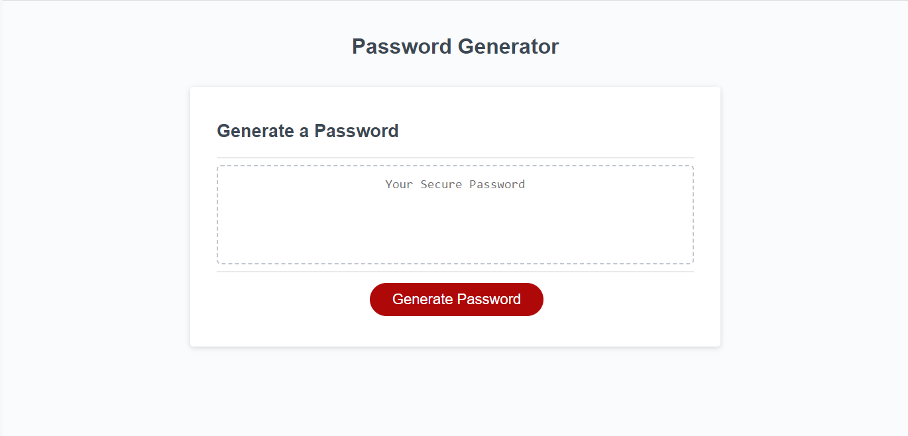
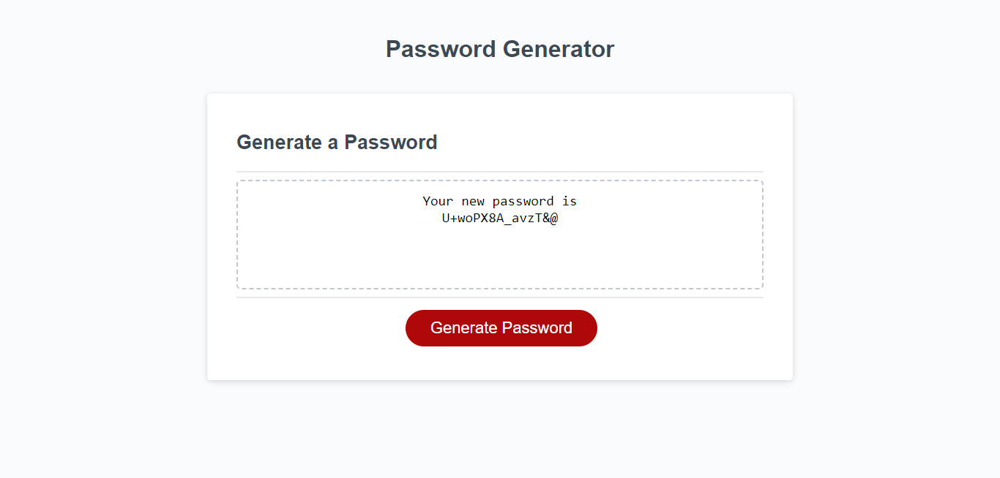

# Andrew's Password Generator Demo

## Description

For the Third Module Challenge in my coding boot camp, I was tasked with building a randomized password generator, using source code HTML and CSS with original advanced JavaScript.

The Acceptance Criteria is as follows:

GIVEN I need a new, secure password
WHEN I click the button to generate a password
THEN I am presented with a series of prompts for password criteria
WHEN prompted for password criteria
THEN I select which criteria to include in the password
WHEN prompted for the length of the password
THEN I choose a length of at least 8 characters and no more than 128 characters
WHEN asked for character types to include in the password
THEN I confirm whether or not to include lowercase, uppercase, numeric, and/or special characters
WHEN I answer each prompt
THEN my input should be validated and at least one character type should be selected
WHEN all prompts are answered
THEN a password is generated that matches the selected criteria
WHEN the password is generated
THEN the password is either displayed in an alert or written to the page

## Usage

When the user clicks on "Generate" they are given a prompt to choose a password length (between 8 and 128 characters). Then the user is given the choice of choosing to include or exclude Uppercase letters, Lowercase letters, Numbers, or Special Characters. The Password Generator Demo will create and display a randomized password within the chosen parameters.

## Screenshot

## Credits

Source code for HTML and CSS:
https://github.com/coding-boot-camp/friendly-parakeet

## License

N/A